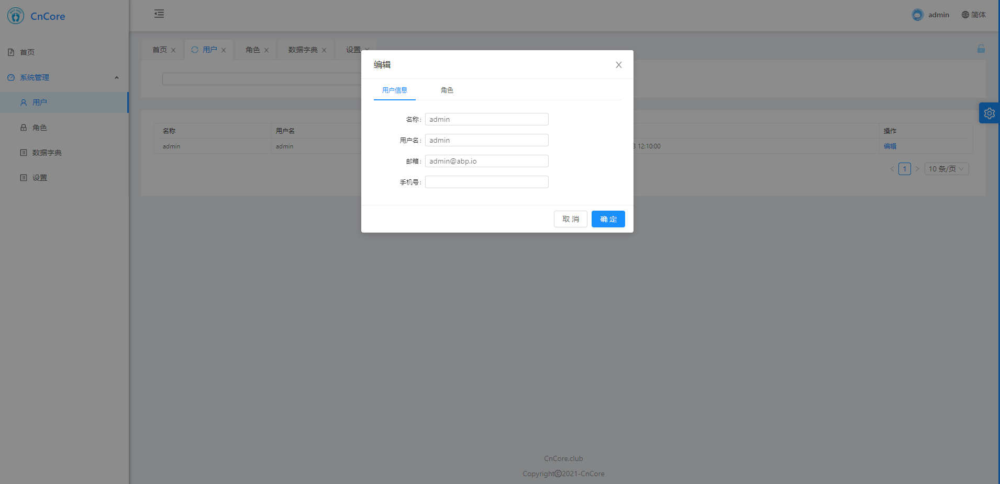
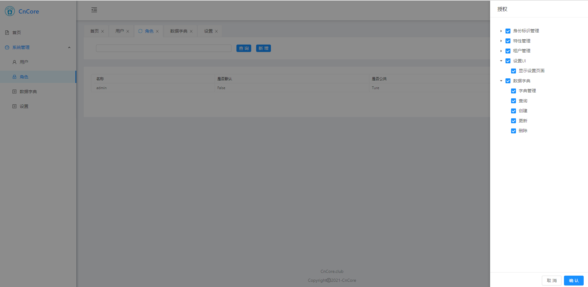
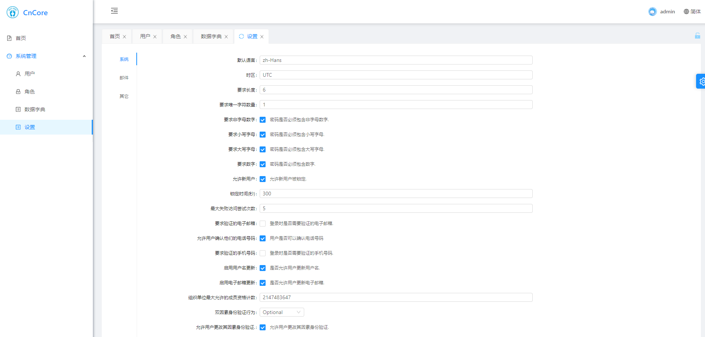
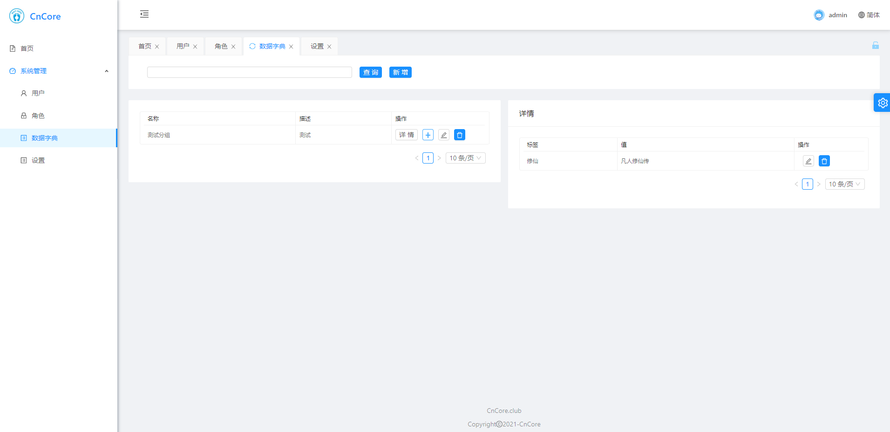

<div align="center">

[Abp Vnext Pro](https://github.com/WangJunZzz/abp-vnext-pro) 的 Vue 实现版本  
开箱即用的中后台前端/设计解决方案

<table>
    <tr>
        <td></td>
        <td></td>
    </tr>
    <tr>
         <td></td>
        <td></td>
    </tr>
</table>
</div>
### 依赖

- .Net Core5.0
- Abp Vnext 4.x ,
- Ant Design, Vue2.x
- Mysql,Redis,Hangfire,ES(日志可选),Nocas(可选,未集成,计划中),RabbitMq(未集成,计划中)
- 微服务架构设计, DDD 实践
- 容器化 CI CD

### 系统功能

- 用户管理
- 角色管理
- 设置管理
- 字典管理
- 后台作业
- ES 日志
- 审计日志(关闭了审计日志)
- 暂时不支持多租户管理(后续考虑)

### 使用

#### clone

```bash
$ git clone https://github.com/WangJunZzz/abp-vnext-pro
```

#### 后端

- 修改 Mysql,Redis 连接字符串
- 迁移数据：执行 Zzz.DbMigrator

#### 前端

- yarn or npm i
- npm run dev

#### 该项目也是一个模板项目

- 本地安装

```bash
# 在cotnent目录下执行
 dotnet new -i .\content
```

- 新建项目

```bash
dotnet new Zzz --name 你的项目名称(不支持名词xxx.xxx,只支持一级)
```

#### 参与贡献

非常欢迎你的贡献，你可以通过以下方式和我们一起共建 :star2:：

- 通过 [Issue](https://github.com/WangJunZzz/abp-vnext-pro/issues) 报告:bug:或进行咨询。

- 加入社群，与小伙伴们一同交流心得。QQ 群：686933575
