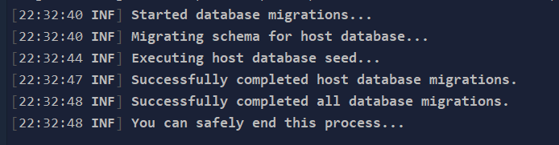

# 快速开始

## 先决条件
- [dotnet core 6.0.202](https://dotnet.microsoft.com/en-us/download/dotnet/6.0)
- [nodejs 16+](https://nodejs.org/zh-cn/)
- [pnpm](https://www.pnpm.cn/installation)
- [mysql](https://dev.mysql.com/downloads/installer/)
- [redis](https://redis.io/docs/getting-started/installation/)
- [rabbitmq 可选](https://www.rabbitmq.com/download.html)


## Docker启动MySql
``` bash
docker run --name mymysql -p 3306:3306 -e MYSQL_ROOT_PASSWORD=1q2w3E* -d mysql:5.7 --character-set-server=utf8mb4 --collation-server=utf8mb4_unicode_ci
```
## Docker启动Redis
``` bash
docker run --name myredis -p 6379:6379 -d redis:latest redis-server
```
## Docker启动RabbitMq
``` bash
docker run -d --name myrabbitmq -e RABBITMQ_DEFAULT_USER=admin -e RABBITMQ_DEFAULT_PASS=admin -p 15672:15672 -p 5672:5672 rabbitmq:management
```
## 创建新项目


### 安装Cli工具
- [仓库地址](https://github.com/WangJunZzz/Lion.AbpPro.Cli)

``` bash
dotnet tool install Lion.AbpPro.Cli -g
```

### 生成项目

**提供了三个模板生成**
- 生成源码版本

```bash
lion.abp new abp-vnext-pro -c 公司名称 -p 项目名称 -o 输出路径(可选) -v 版本号(可选)
```

- nuget包形式的基础版本,包括abp自带的所有模块，已经pro的通知模块，数据字典模块 以及ocelot网关

```bash
lion.abp new abp-vnext-pro-basic -c 公司名称 -p 项目名称 -v 版本(默认LastRelease) -o 项目输出路径(可选).
```

- nuget包形式的基础版本,包括abp自带的所有模块，已经pro的通知模块，数据字典模块 无ocelot网关
```bash
lion.abp new abp-vnext-pro-basic-no-ocelot -c 公司名称 -p 项目名称 -v 版本(默认LastRelease) -o 项目输出路径(可选).
```


### 后端
- 修改 HttpApi.Host-> appsettings.json 配置
    - Mysql 连接字符串
    - Redis 连接字符串
    - RabbitMq(如果不需要启用设置为 false)
    - Es 地址即可(如果没有 es 也可以运行,只是前端 es 日志页面无法使用而已，不影响后端项目启动)
- 修改 IdentityServer-> appsettings.json 数据库连接字符串
- 修改 DbMigrator-> appsettings.json 数据库连接字符串
- 右键单击.DbMigrator项目,设置为启动项目运行，按F5(或Ctrl + F5) 运行应用程序. 它将具有如下所示的输出:


!!! note 种子数据

    初始的种子数据在数据库中创建了 admin 用户(密码为1q2w3E*) 用于登录应用程序. 所以, 对于新数据库至少使用 .DbMigrator 一次.


!!! note Ocelot网关

    如果不需要使用Ocelot网关可以移除Lion.AbpPro.WebGateway项目，前端接口地址直接修改为Lion.AbpPro.HttpApi.Host的接口地址。


- 多项目启动(HttpApi.Host,IdentityServer,WebGateway)，就能看到后台服务登陆页面，如下：


  


## 前端
- [Vben Admin 文档](https://vvbin.cn/doc-next/)

### 安装npm包

```bash
pnmp install 
```

### 启动项目

```bash
npm run dev
```
