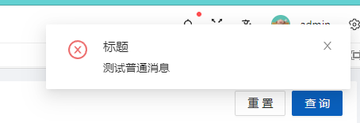

# 实时通信
集成Abp SignalR,实现类似站内信模块。

- 发送消息会在前端右上角，根据不同消息等级有不同的窗体提示。



- 在右上角灯泡按钮可以看到接受的消息。


## 安装

- Lion.Abp.NotificationManagement.Application
- Lion.Abp.NotificationManagement.Application.Contracts
- Lion.Abp.NotificationManagement.Domain
- Lion.Abp.NotificationManagement.Domain.Shared
- Lion.Abp.NotificationManagement.EntityFrameworkCore
- Lion.Abp.NotificationManagement.HttpApi
- Lion.Abp.NotificationManagement.HttpApi.Client

## 模块依赖

- 添加 DependsOn(typeof(NotificationManagementXxxModule)) 特性到对应模块。

- 在EntityFrameworkCore层添加数据库配置在AbpProDbContext.cs的OnModelCreating()方法中添加builder.ConfigureNotificationManagement();

## 实体
**Notification** 表结构：

字段名 | 描述 | 类型
:---|:---|:---
Id |  Id | Guid
Title | 消息标题 | string
Content | 消息内容 | string
MessageType | 消息类型 | MessageType
MessageLevel | 消息等级 | MessageLevel
SenderId | 创建人 | 发送人
NotificationSubscriptions | 消息订阅者集合 | List<NotificationSubscription>
IsDeleted | 是否删除 | bool
DeleterId | 删除人 | Guid?
DeletionTime | 删除时间 | DateTime
LastModifierId | 最后修改人 | Guid?
LastModificationTime | 最后修改时间 | DateTime
CreatorId | 创建人 | Guid?
CreationTime | 创建时间 | DateTime

**NotificationSubscription** 表结构：

字段名 | 描述 | 类型
:---|:---|:---
Id |  Id | Guid
ReceiveId |  接收人 | Guid
Read | 是否已读 | bool
ReadTime | 已读时间 | DateTime?
IsDeleted | 是否删除 | bool
DeleterId | 删除人 | Guid?
DeletionTime | 删除时间 | DateTime
LastModifierId | 最后修改人 | Guid?
LastModificationTime | 最后修改时间 | DateTime
CreatorId | 创建人 | Guid?
CreationTime | 创建时间 | DateTime

## 发送消息
- 注入NotificationManager,NotificationAppService即可发送不同级别，不同等级的消息。
- 发送给指定人
```csharp
/// <summary>
/// 发送警告文本消息
/// </summary>
/// <param name="title">标题</param>
/// <param name="content">消息内容</param>
/// <param name="receiveIds">接受人，发送给谁。</param>
await _notificationManager.SendCommonWarningMessageAsync(title,content,receiveIds);
```
- 发送给所有人
```csharp
/// <summary>
/// 发送警告文本消息
/// </summary>
/// <param name="title">标题</param>
/// <param name="content">消息内容</param>
await _notificationManager.SendBroadCastInformationMessageAsync(title,content);
```

## 依赖
- 如果服务分布式部署，需要使用Redis(默认依赖),解决SignalR消息重复问题。
```csharp
private void ConfigurationSignalR(ServiceConfigurationContext context)
{
    var redisConnection = context.Services.GetConfiguration()["Redis:Configuration"];
    if (redisConnection.IsNullOrWhiteSpace())
    {
        throw new UserFriendlyException(message: "Redis连接字符串未配置.");
    }
    context.Services.AddSignalR()
    .AddStackExchangeRedis(redisConnection, options => { options.Configuration.ChannelPrefix = "Lion.AbpPro"; });
}
```

## Vue客户端连接
- 在用户登陆成功之后，连接SignalR,并且带自动重连机制。[源码](https://github.com/WangJunZzz/abp-vnext-pro/blob/main/vben28/src/hooks/web/useSignalR.ts)
- 示例如下:


```ts
const { startConnect } = useSignalR();
      onMounted(() => {
        startConnect();
      });
```